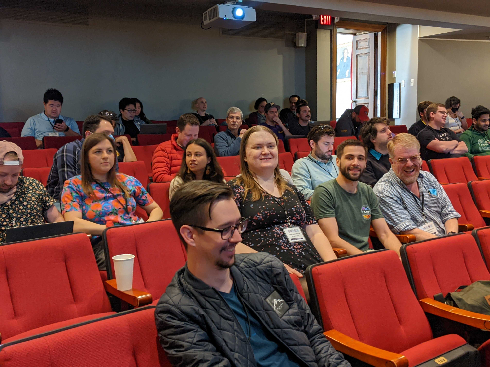

I've worked in a lot of programming languages through the years, but I find myself drawn to functional programming languages more than most. For those who aren't familiar, functional programming languages are defined by their focus on writing and passing functions rather than modifying a program's state. In pure functional programming, functions should have no side effects at all, and a function's output is solely determined by its input rather than any outside state. This process is more mathematically formal than object-oriented programming, and functional programs are often less buggy and easier to validate and test. Of course, the flip side of this is that functional programs can be harder to write and get working in the first place, and many programmers are put off by the sheer mathiness of most functional languages. I was a math major in college, though, so if anything the mathiness is why I like functional programming.

Even though I was a math major, I took a lot of computer science classes when I was at Caltech. Part of that was so I would have job prospects if math academia didn't work out (which paid off well!), but I mostly wanted to learn more about an interesting field that I hadn't explored much before college. One course I took early on taught lambda calculus and functional programming using [Racket](https://racket-lang.org/), a fork of Scheme, which is itself a dialect of Lisp, the first functional programming language. I liked that course well enough that I took another course on Haskell the next year, and I did well enough in that course that I became a teaching assistant for it my senior year. It probably helped that Haskell is inspired by category theory, which I was working on at the same time for my math degree.

The one major drawback to Haskell is that it's not used much in the programming industry; companies prefer languages that have a larger pool of available developers, and formal validation don't always go well with the flexibility and deadlines companies need. As a result, I switched back to object-oriented languages after I graduated, and I spent very little time with functional programming for the next few years. After I started working for Bendyworks, though, I was reintroduced to functional programming through my coworkers. While Bendyworks was mainly a Ruby on Rails and React shop at the time, its employees have pretty diverse development backgrounds, and a few were interested in functional languages. I spent a little time looking into Clojure, but I really got back into functional programming when a group of us started learning Elixir together. Despite being functional, Elixir draws some inspiration from Ruby on Rails &ndash; its creator comes from a Rails background, and the syntax is easy to pick up if you're familiar with Rails. Elixir is also a scalable language that's already in use at large software companies, so it seemed a lot more useful for building apps than my other functional languages. (Not that I don't like languages that are elegant for the sake of it &ndash; I *am* a math major, after all &ndash; but I also like to build things.)

*Me and the Bendyworks team at The Big Elixir*

The group learning Elixir at Bendyworks turned into a regular meetup, and we started building some small Elixir apps together. We also learned about Phoenix and LiveView, which we incorporated into the apps we were building, and looked into adding Elixir to the languages Bendyworks formally offered. A group of us even went down to [The Big Elixir](https://thebigelixir.com/) in New Orleans for two days of hearing about the newest developments in Elixir and learning what other people were building. The trip also gave us an opportunity to network with some of the other companies doing Elixir work. While the projects Bendyworks landed still mainly used Rails, we were excited to have a strong team of Elixir developers within the company.

I've used so many languages over my career that I don't dare predict the future any more, but I hope that future includes more functional programming. I still love Rails, but I'd also love to spend more time working on Elixir on the backend. With my background in C#, I could see myself looking into F# at some point. And of course, new and exciting programming languages are always springing up, so who knows what could be the big new thing in functional programming in five or ten years? In any case, I hope that I'm always still learning, and that my math background will continue to influence my programming career.
